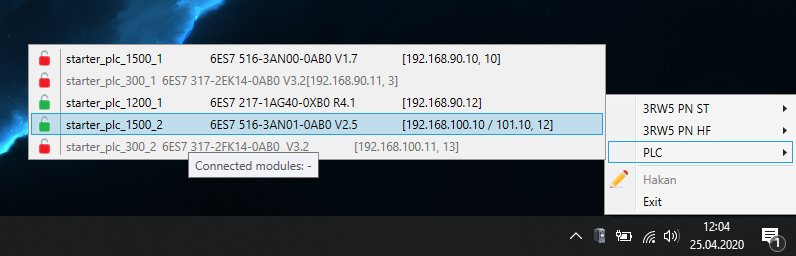

# Device Manager Readme

This is a Windows desktop application that lets you and your team track the availability of your hardware. 

## Features

*  Runs as a system tray application
*  Designed for multi-user / team use
*  Customizable hardware groups & items, through "Device Manager Server" web interface
*  Continuous synchronization of hardware status

## Installing

*  Download the server application setup [from here](https://code.siemens.com/hakan.yildizhan/device-manager/-/raw/master/releases/server/DeviceManager_server_1.1.0.msi). Follow the instructions here to get the server up and running: [Installation of server application](https://code.siemens.com/hakan.yildizhan/device-manager/-/wikis/Documentation%20Server/1.%20Installation%20of%20server%20application)

*  Once server application is installed, download the client application setup [from here](https://code.siemens.com/hakan.yildizhan/device-manager/-/raw/master/releases/client/DeviceManager_client_1.1.1.msi). Instructions on how to install & use the application can be found here: [Installation of client application](https://code.siemens.com/hakan.yildizhan/device-manager/-/wikis/Documentation-Client/1.-Installation-of-client-application)

## Requirements

**Server:**

*  .NET Framework 4.6.1 or later
*  Internet Information Services to be enabled (via "Turn Windows features on or off")
*  SQL Server or SQL Express 

**Client:**

*  .NET Framework 4.6.1 or later
*  Requires Device Manager Server to be installed

## Release Notes

You can find all release information [here](https://code.siemens.com/hakan.yildizhan/device-manager/-/releases).